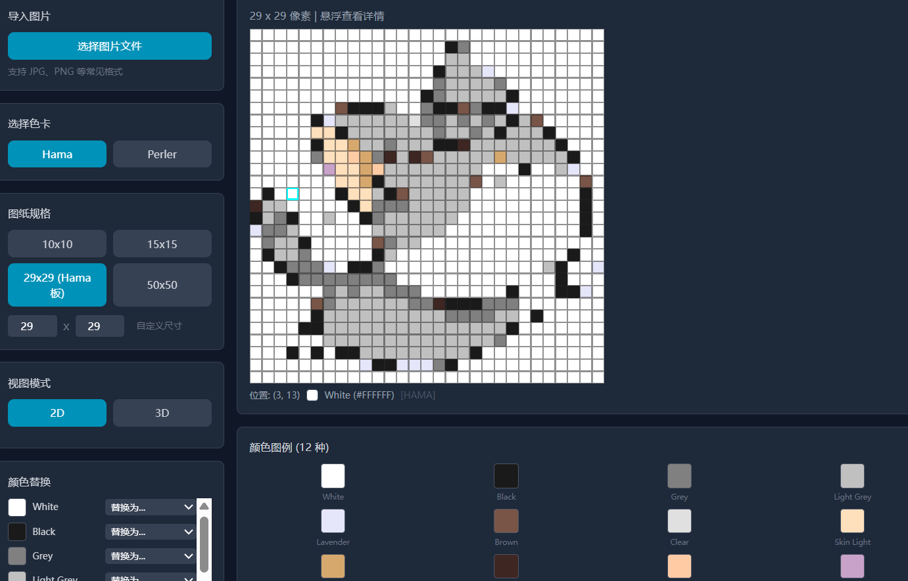

# 拼豆图纸生成器

一款在线生成拼豆（Perler Beads / Hama Beads）像素图纸的工具，支持 2D/3D 视图预览、颜色替换和图纸导出。




## 功能特性

- **图片导入** - 上传任意图片，自动转换为拼豆像素图纸
- **预设色卡** - 支持 Hama（38色）和 Perler（40色）两大品牌色卡
- **颜色替换** - 一键将图纸中的某个颜色替换为其他颜色
- **多规格支持** - 预设 10x10、15x15、29x29（Hama标准板）、50x50 等规格，支持自定义尺寸
- **2D/3D 视图** - 2D 像素网格视图和 3D 空心圆柱/球体视图
- **3D 交互** - 鼠标拖拽旋转、滚轮缩放、悬浮高亮
- **导出打印** - 支持导出 PNG 图片和 PDF 文档

## 技术栈

- **框架**: React 18 + TypeScript + Vite
- **3D 渲染**: Three.js + @react-three/fiber + @react-three/drei
- **状态管理**: Zustand
- **样式**: Tailwind CSS
- **导出**: jsPDF + html2canvas

## 快速开始

```bash
# 安装依赖
npm install

# 启动开发服务器
npm run dev

# 构建生产版本
npm run build
```

## 使用说明

1. **选择色卡** - 在左侧面板选择 Hama 或 Perler 色卡
2. **设置规格** - 选择或自定义图纸尺寸
3. **导入图片** - 点击"选择图片文件"上传图片
4. **生成图纸** - 系统自动将图片转换为拼豆像素图纸
5. **颜色替换** - 在"颜色替换"面板选择颜色进行替换
6. **切换视图** - 在"视图模式"中切换 2D/3D 视图
7. **导出图纸** - 点击 PNG 或 PDF 按钮导出

## 项目结构

```
src/
├── components/
│   ├── Canvas2D/          # 2D像素图纸视图
│   ├── Canvas3D/          # 3D视图
│   ├── Controls/          # 控制面板组件
│   └── Layout/            # 布局组件
├── stores/
│   └── beadStore.ts       # Zustand 状态管理
├── utils/
│   ├── colorQuantization.ts # 颜色量化算法
│   ├── hamaColors.ts       # Hama 色卡
│   ├── perlerColors.ts     # Perler 色卡
│   └── imageProcessor.ts   # 图像处理
└── types/
    └── index.ts            # TypeScript 类型定义
```

## License

MIT
