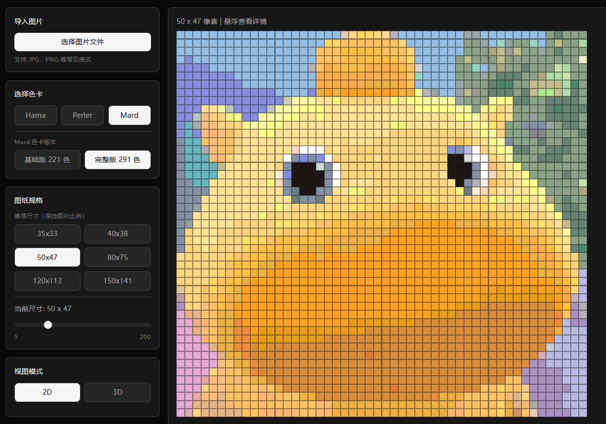

# 拼豆图纸生成器

[在线体验](https://knight02-bit.github.io/PinDouGenerator/)

一个面向拼豆创作场景的在线图纸生成工具。上传图片后，应用会按所选拼豆品牌色卡进行颜色量化，并生成适合查看、预览和导出的拼豆图纸。




## 项目简介

这个项目适合用来做以下事情：

- 把普通图片快速转换为拼豆图纸
- 按品牌色卡查看实际可用颜色
- 按官方编号快速对照实体拼豆颜色
- 按图片比例自动生成推荐尺寸
- 在 2D / 3D 视图之间切换查看成品效果
- 导出 PNG 或 PDF 方便保存、打印或分享


## 色卡说明

- `Hama`：使用官方核心标准色编号体系，**包含 Hama Midi 全系列**
  
  > [Hama 拼豆色号大全 (2024整理版)](https://www.pixel-beads.com/zh/hama-bead-color-chart)
- `Perler`：使用官方编号体系，P \*
  
  > [Perler 拼豆色号大全 (2026重新修订版)](https://www.pixel-beads.com/zh/perler-bead-color-chart)
- `Mard`：使用官方编号体系，基础版为 `A ~ M` 共 `221` 色，完整版额外包含 `P / Q / R / T / Y / ZG`，共 `291` 色
  > [MARD 拼豆色号大全 (2026重新修订版)](https://www.pixel-beads.com/zh/mard-bead-color-chart)
  
  颜色图例、悬浮提示和搜索均可直接按官方编号或 `HEX` 查找颜色


## 当前功能

- **图片导入**：支持选择本地图片文件，自动读取并生成图纸
- **品牌色卡**：支持 `Hama`、`Perler`、`Mard` 三套色卡切换
- **官方编号**：`Hama`、`Perler`、`Mard` 均已按官方编号体系显示颜色编号
- **Mard 版本切换**：选择 `Mard` 后可切换 `基础版 221 色` 和 `完整版 291 色`
- **尺寸控制**：支持固定预设尺寸和滑块调节，当前滑动范围为 `5 ~ 200`
- **比例适配**：上传图片后会根据原图比例生成推荐尺寸
- **2D 视图**：查看像素化后的拼豆排布结果
- **3D 视图**：支持空心圆柱和球形两种拼豆外观
- **导出图纸**：支持导出 `PNG` 和 `PDF`
- **深色界面**：默认深色主题，更适合长时间查看图纸


## 使用流程

1. 选择拼豆品牌色卡
2. 选择推荐尺寸、默认尺寸，或拖动滑块调整尺寸
3. 上传一张本地图片
4. 等待系统按当前色卡自动生成图纸
5. 如果使用 `Mard`，可按需要切换 `基础版 221 色` 或 `完整版 291 色`
6. 在 `2D` / `3D` 视图中检查效果，并通过官方编号核对颜色
7. 根据需要选择导出 `PNG` 或 `PDF`


## 运行环境

- `Node.js 20+`，推荐使用较新的 LTS 版本
- `npm 10+`

## 快速开始

```bash
npm install
npm run dev
```

开发服务器启动后，按终端提示访问本地地址即可。

## 可用脚本

```bash
# 启动开发环境
npm run dev

# 生产构建
npm run build

# 代码检查
npm run lint

# 预览构建产物
npm run preview
```

## 技术栈

- `React 19`
- `TypeScript`
- `Vite`
- `Zustand`
- `Three.js`
- `@react-three/fiber`
- `@react-three/drei`
- `Tailwind CSS`
- `html2canvas`
- `jsPDF`

## 目录结构

```text
PinDouGenerator/
├── .github/workflows/     # GitHub Pages 自动部署
├── public/                # 静态资源
├── src/
│   ├── components/
│   │   ├── Canvas2D/      # 2D 图纸展示
│   │   ├── Canvas3D/      # 3D 场景与模型展示
│   │   ├── Controls/      # 上传、尺寸、色卡、导出等控制面板
│   │   └── Layout/        # 页面布局
│   ├── stores/            # Zustand 状态管理
│   ├── types/             # 类型定义
│   └── utils/             # 图像处理、色卡与颜色量化工具
├── README.assets/         # README 配图资源
└── README.md
```

## 关键模块说明

- `src/stores/beadStore.ts`：全局状态中心，负责尺寸、色卡、原图数据和图纸生成流程
- `src/components/Controls/ImageUploader.tsx`：处理本地图片导入
- `src/components/Controls/SizeSelector.tsx`：处理默认尺寸、推荐尺寸和滑块调节
- `src/components/Controls/BrandSelector.tsx`：切换品牌色卡，并在 `Mard` 下切换基础版 / 完整版
- `src/components/Controls/ViewModeSelector.tsx`：切换 2D / 3D 视图与 3D 拼豆样式
- `src/components/Controls/ExportPanel.tsx`：导出 PNG / PDF
- `src/utils/colorQuantization.ts`：将图片颜色映射到当前色卡
- `src/utils/hamaColors.ts`：Hama 官方编号色卡
- `src/utils/perlerColors.ts`：Perler 官方编号色卡
- `src/utils/mardColors.ts`：Mard 基础版 / 完整版官方编号色卡

## 部署说明

项目已包含 GitHub Pages 自动部署工作流：

- 工作流文件：`.github/workflows/deploy.yml`
- 触发方式：推送到 `main` 分支后自动执行
- 流程内容：安装依赖、执行 `npm run build`、发布 `dist/` 到 GitHub Pages

如果你是第一次部署，记得在仓库设置中开启 GitHub Pages，并确认 Pages 来源与工作流配置一致。

## 注意事项

- 推荐尺寸会尽量保持原图比例，但会受当前推荐档位限制
- 滑块尺寸范围是 `5 ~ 200`，并不代表所有图片在这个范围内都能得到完全相同的视觉效果
- 导出清晰度可在界面中选择 `1x`、`2x`、`3x`
- 当前导出主要包含图纸内容，尚未输出完整的官方色号图例清单
- 当前 README 仅描述已经接入主界面的功能，不包含未启用或开发中的实验性组件

## 后续可扩展方向

- 增加颜色替换与撤销的可视化入口
- 支持导出带色号图例的图纸
- 增加更多拼豆品牌和自定义色卡导入

## License

MIT
